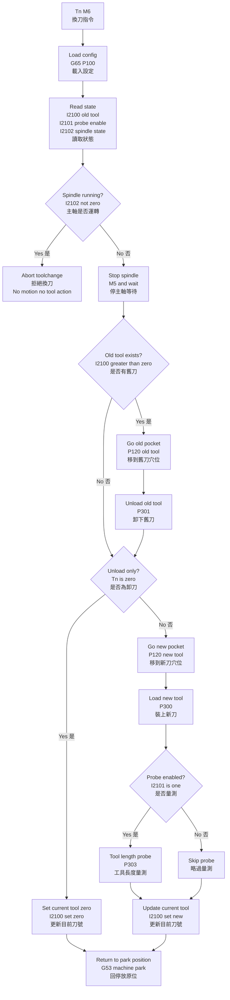

# E2D Tools Change Macros for grblHAL（SD 卡 ATC）

本專案提供一套 **專為 grblHAL 設計的 ATC（Automatic Tool Change）G-code Macro 架構**。
適用環境與限制如下：

- Macro 來源為 **SD 卡**
- 控制器支援數字變數與 `G65 P3`（Parameter store）
- **不支援命名變數 `#<_...>`**
- 部分 build 對 `.macro` 檔案 **不接受非 ASCII 字元**（註解也不行）

因此本專案採用：

- `.macro` 檔案：**全 ASCII（英文註解）**
- 文件（README）：**繁體中文完整說明**

參考文件：
- [參數和表達式](https://github.com/grblHAL/core/wiki/Expressions-and-flow-control)

必要編譯選項（節錄）：

```code
/*! \def NGC_EXPRESSIONS_ENABLE
\brief
Set to \ref On or 1 to enable experimental support for parameters and expressions.

Some LinuxCNC extensions are supported, conditionals and subroutines are not.
*/
#if !defined NGC_EXPRESSIONS_ENABLE || defined __DOXYGEN__
#define NGC_EXPRESSIONS_ENABLE Off
#endif

/*! \def NGC_N_ASSIGN_PARAMETERS_PER_BLOCK
\brief
Maximum number of parameters allowed in a block.
*/
#if (NGC_EXPRESSIONS_ENABLE && !defined NGC_N_ASSIGN_PARAMETERS_PER_BLOCK) || defined __DOXYGEN__
#define NGC_N_ASSIGN_PARAMETERS_PER_BLOCK 10
#endif
```

---
## 特色

- 支援 `Tn M6` 自動換刀與 `T0 M6` 卸刀
- 每把刀對應固定夾頭穴（卸刀/裝刀同一座標）
- 卸刀：主軸逆轉 + Z 下壓 + 停主軸等待
- 裝刀：主軸正轉 + Z 下壓 + 停主軸等待
- 工具長度量測（G38.2 + G43.1）
- 換刀結束回 **固定 G53 停放點**

---
## 系統需求

- grblHAL
- Macro 儲存位置：SD 卡（根目錄或 firmware 設定的 macro 目錄）
- 功能需求：
  - 支援數字變數（例如 `#1`, `#31`）
  - 支援 `G65 P3`（Parameter store，且 `S<m>` 回填可用）
- 設定：
  - `$675 = 3`
    - bit0：允許 `M6 T0`
    - bit1：找不到 `tc.macro` 則 `M6` 失敗

---
## 檔案結構

| 檔案 | 用途 |
|---|---|
| `P100.macro` | 參數設定 + 刀具表寫入（寫入 P3 參數區） |
| `P120.macro` | 依刀號移到固定夾頭穴（從 P3 參數區讀 X/Y） |
| `P301.macro` | 卸下舊刀（逆轉 + Z 下壓 + 停主軸等待） |
| `P300.macro` | 裝上新刀（正轉 + Z 下壓 + 停主軸等待） |
| `P303.macro` | 工具長度量測（G38.2 / G43.1） |
| `tc.macro` | 換刀主流程（由 `Tn M6` 觸發） |

---
## 換刀流程（文字版）

1. 停止主軸
2. 移到舊刀固定夾頭穴（依刀具表）
3. 卸下舊刀（逆轉 1000~1200 RPM、Z 下壓速度、停轉秒數）
4. 移到新刀固定夾頭穴（依刀具表）
5. 裝上新刀（正轉 1000~1200 RPM、Z 下壓速度、停轉秒數）
6. 工具長度量測
7. 回到固定 G53 停放點（原位）

---
## 流程圖（Mermaid）
 


---
## 安裝方式（SD 卡）

1. 將所有 `.macro` 檔案複製到 **SD 卡的 macro 目錄**（依控制器設定）
2. 建議檔名使用小寫（尤其是 `tc.macro`）
3. 插入 SD 卡並重啟控制器

注意：本環境的 `.macro` 檔案建議 **ASCII-only**（避免非 ASCII 字元造成解析錯誤）。

---
## 首次使用初始化（必要）

本系統使用 **P3 參數 `I2100`** 保存「目前主軸刀號」。首次使用前請初始化：

- 主軸目前為空刀：
```gcode
G65 P3 I2100 Q0
```

- 主軸目前已裝 T3：
```gcode
G65 P3 I2100 Q3
```

---
## 操作方式

由於部分 grblHAL 構建不支援 G65 參數傳遞，本系統提供兩種換刀方式：

### 方法 1：手動預設刀號（推薦）
```gcode
G65 P3 I2200 Q1         (設定選擇刀號為 T1)
M6                      (執行換刀)
```

### 方法 2：使用 P200 包裝宏（如果 G65 參數支援）
```gcode
G65 P200 A1             (換到 T1)
```

### 卸刀（空主軸）
```gcode
G65 P3 I2200 Q0         (設定刀號為 0)
M6                      (執行卸刀)
```

---
## 回原位設計（為何不是回加工座標）

本控制器環境不支援 `#<_x>` `#<_y>` `#<_z>` 這類命名狀態變數，
無法在 macro 內保存並回到「換刀前工作座標」，因此採用工業常見做法：

- 換刀完成後回到固定 G53 停放點

停放點參數在 `P100.macro` 中定義：

- `#1020` 停放 X（G53）
- `#1021` 停放 Y（G53）
- `#1022` 停放 Z（G53）

---
## 參數對照表（P100.macro）

| 變數 | 說明 |
|---|---|
| `#1000` | 安全 Z（G53） |
| `#1001` / `#1002` | 卸刀 / 裝刀 Z 下壓量（mm） |
| `#1003` / `#1004` | 卸刀（M4）/ 裝刀（M3）RPM |
| `#1005` / `#1006` | 卸刀 / 裝刀 Z 速度（mm/min） |
| `#1007` / `#1008` | 卸刀 / 裝刀 停主軸等待（秒） |
| `#1009` | 額外退回量（mm） |
| `#1010~#1016` | 探針設定（G53 / G38.2 / TLO） |
| `#1020~#1022` | 停放點（G53） |

刀具表（固定夾頭穴）存放於 P3 參數區：

- BASE = 2000
- Tn：X = I(2000 + (n-1)*2)，Y = I(同 + 1)

---
## 是否量測開關（P3 I2101）

P3 參數 I2101 控制換刀後是否執行量測（`P303.macro`）。

- I2101 = 1：換刀後執行量測
- I2101 = 0：換刀後跳過量測

設定範例：

```gcode
G65 P3 I2101 Q1   (開啟量測，建議預設)
G65 P3 I2101 Q0   (關閉量測)
```

行為說明：

- 僅在新刀號 ≠ 0（非 T0）時才會依 I2101 決定是否量測
- `T0 M6`（卸刀）不會執行量測

---
## ATC 防呆：主軸運轉中拒絕換刀（P3 I2102）

本控制器無法在 macro 內讀取即時主軸狀態或 RPM 命名變數，
改用 P3 參數 I2102 作為主軸狀態互鎖：

- I2102 = 0：主軸視為停止 → 允許換刀
- I2102 ≠ 0：主軸視為運轉中 → 拒絕換刀

換刀時的防呆行為：

- `tc.macro` 啟動時若偵測到 I2102 ≠ 0：
  - 立即中止換刀流程
  - 不進行任何移動或刀具操作
  - 避免主軸運轉中發生機械危險

---
## 建議的主軸控制方式（確保防呆有效）

建議用宏取代直接 `M3 / M4 / M5`，以同步更新 I2102：

主軸正轉（寫入 I2102）
```gcode
G65 P3100 A12000 B3
```

主軸逆轉（寫入 I2102）
```gcode
G65 P3100 A1100 B4
```

停止主軸（清除 I2102）
```gcode
G65 P3101
```

說明：

- `P3100.macro` 會在啟動主軸時，同步將 RPM 寫入 I2102
- `P3101.macro` 會在停主軸時，將 I2102 清為 0
- 只要 I2102 ≠ 0，`Tn M6` 將被 ATC 防呆拒絕

---
## 測試與驗證建議

1. 執行設定宏（僅寫入參數/刀表）：
```gcode
G65 P100
```
2. 驗證刀位讀取（以 T1 為例）：
```gcode
G65 P120 A1
```
3. 初期空跑建議降低 RPM 與 Z 行程後測試：
```gcode
G65 P301  (卸刀動作)
G65 P300  (裝刀動作)
```
4. 最後測試：
```gcode
T1 M6
T0 M6
```

---
## 防呆功能測試方式

模擬主軸運轉中（應拒絕換刀）
```gcode
G65 P3 I2102 Q1100
T1 M6
```

預期結果：
- 換刀被中止
- 不移動、不卸刀、不裝刀

清除主軸狀態後換刀
```gcode
G65 P3 I2102 Q0
T1 M6
```

預期結果：
- 正常執行換刀流程

---
## 補充參數對照表（P3 參數）

| P3 參數 | 用途說明 |
|---|---|
| `I2000~` | 刀具固定夾頭穴座標（X/Y 表） |
| `I2100` | 目前主軸刀號（ATC 狀態） |
| `I2101` | 是否量測開關（0=不量測，1=量測） |
| `I2102` | 主軸指令 RPM（ATC 防呆互鎖） |

---
## 注意事項

- 初期測試請降低 RPM 與 Z 下壓量，先確認方向與深度正確
- 確認夾頭穴結構可承受旋轉卸/裝動作
- 本 ATC 設計在不支援命名變數的 grblHAL 環境下，以 P3 參數區建立狀態與防呆機制
- I2101 與 I2102 讓換刀流程可控、可關閉、可防誤動作
- 不依賴 firmware 客製修改，即可達到接近工業 ATC 的安全行為
